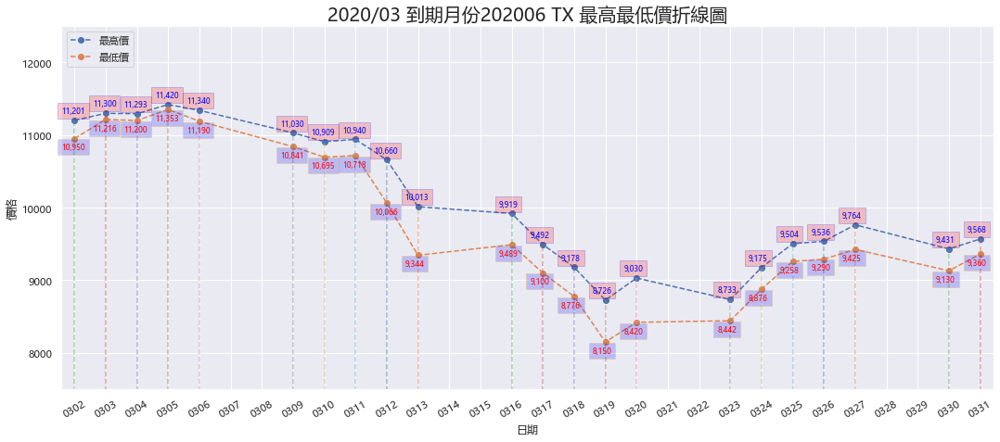
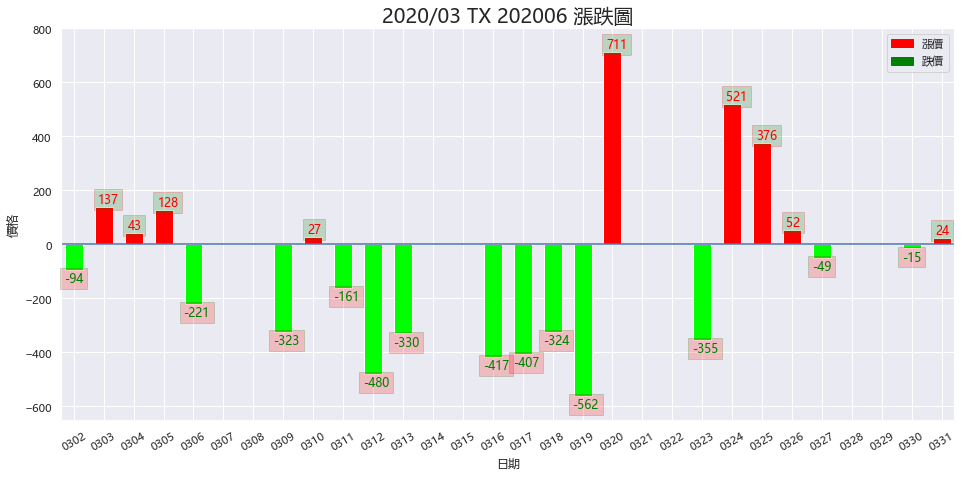
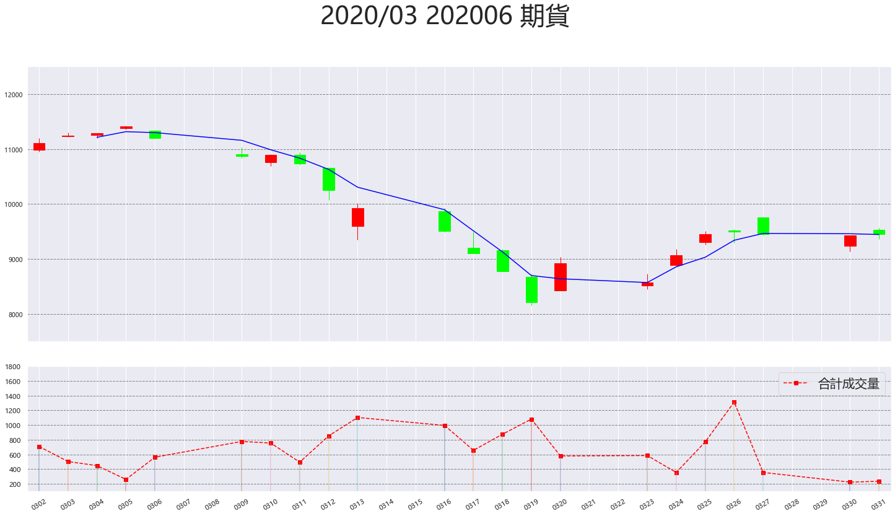

# Futures-crawl
藉由程式中修改爬取日期，爬取當月的期貨資料，來源於台灣期貨交易網。

可在Jupyter中輸入欲顯示的到期租約編號，並繪製出最高最低價走勢、漲跌比較、3日移動平均線、K線圖以及成交量。

運用技術：Python, Scrapy, Pandas, matplotlib, Numpy, Json

開發工具：Jupyter Notebook, VS Code 

專案環境：OS - Windows, DB - MongoDB

最高最低價走勢

漲跌比較

K線圖以及成交量

